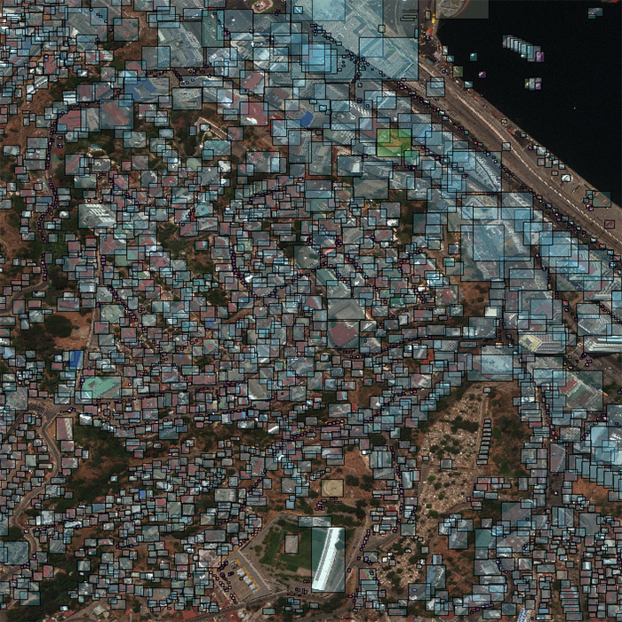
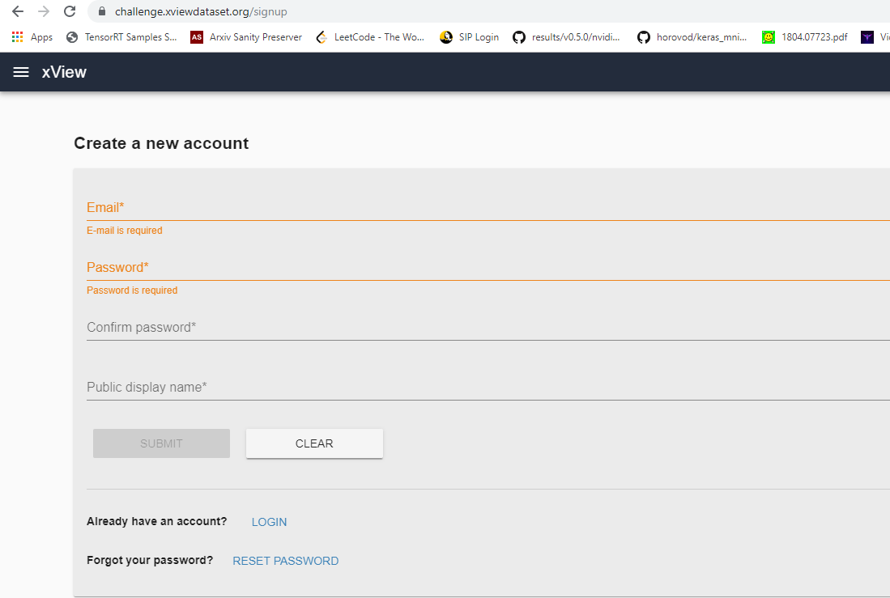
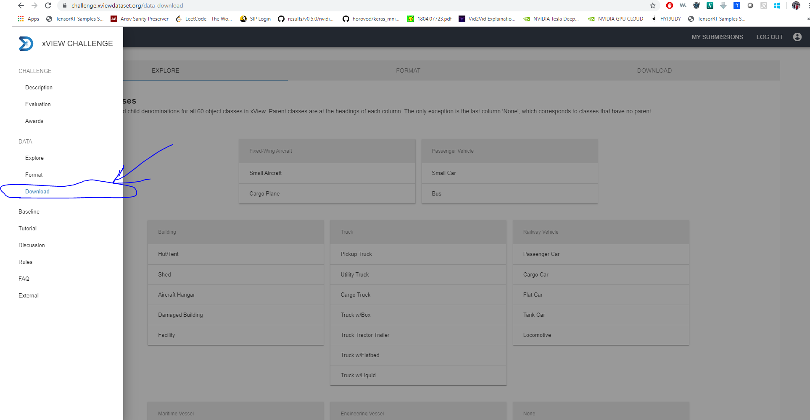
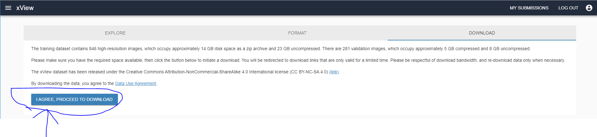
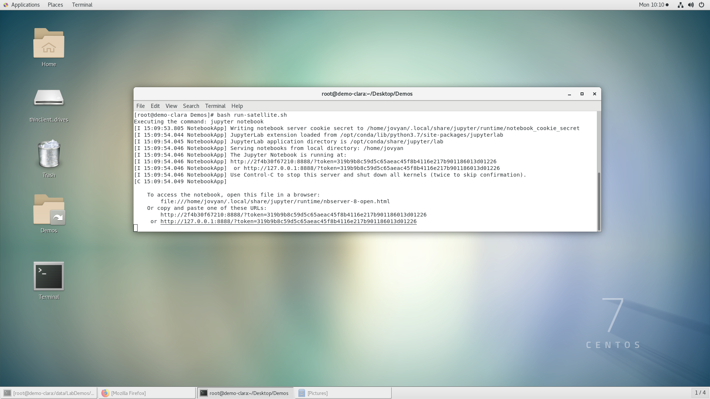
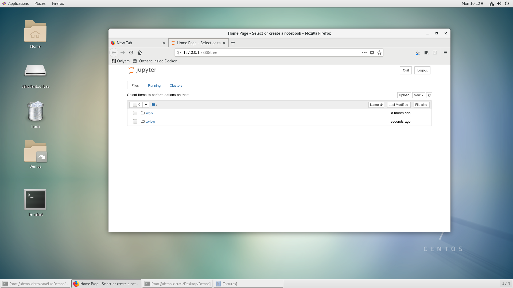
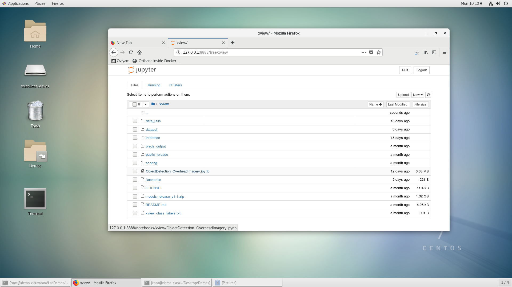
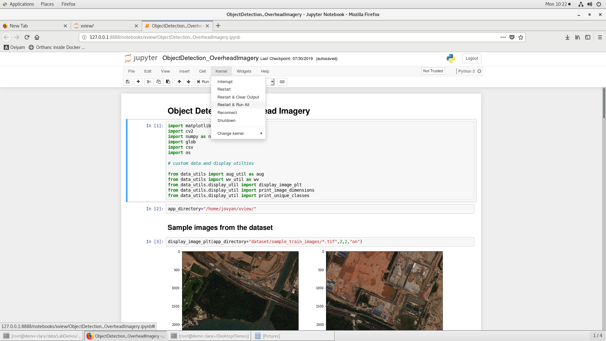
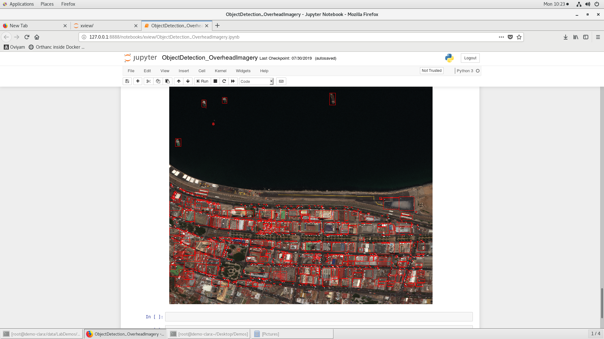
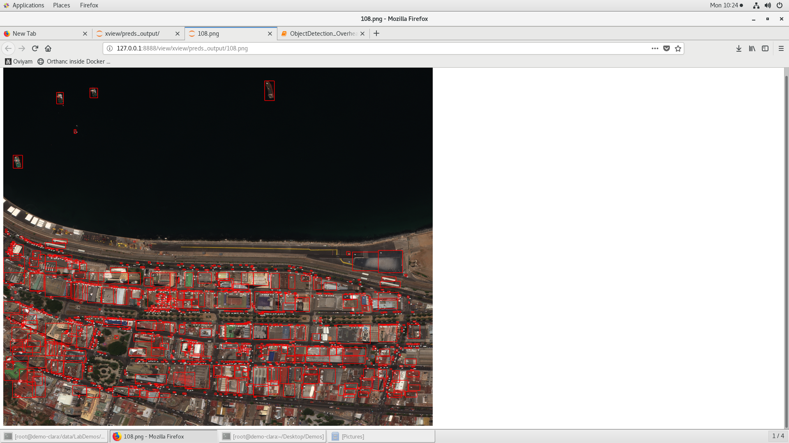

# Running Satellite Imagery Demo    

This documentation is a step by step guide to runninng the satellite imagery object detection demo from [Xview](https://github.com/DIUx-xView). 
We're not going to train the model here, this is just an off the shelf inference with their vanilla 
baseline model.




Image Credits : https://challenge.xviewdataset.org/data-download

### Step 1. Check Validation System Specifications

This demo is validated on a Dell PowerEdge C4130 system having the following specs:

##### H/W Specs:

* 2 X Intel(R) Xeon(R) CPU E5-2690 v4 @ 2.60GHz
* 256 GB DDR4 Ram Memory 
* 2TB disk space
* 4 X Nvidia Tesla P100 PCIe 16GB graphic cards.
* Logitech HD Pro Webcam C920

##### S/W Specs:
* CentOS Linux 7 (Core)
* Docker 1.13.1
* Git 1.8.3.1 


### Step 2. Ensure Prerequisites

Although you might not need an extensive system as the validation system, at the very least you need to have a base installation of Unix OS such as RHEL Centos or Ubuntu and a working docker already installed
to run this demo.  This also requires atleast 50GB (after uncompressing dataset & keeping the original tar as well) of disk space to run. 

If you don't have docker installed, the following links explains how to install docker.
 

For Centos 
```bash
https://docs.docker.com/install/linux/docker-ce/centos/
```

For Ubunutu 
```bash
https://docs.docker.com/install/linux/docker-ce/ubuntu/
```


### Step 3. Getting the dataset  

* Create an account at the Xview website to download the dataset. 
```bash
https://challenge.xviewdataset.org/signup
```





* Login with the credentials and once you're in, you'll be presented with a tab that allows you to download.



If for some reason if you can't find it, go to the following link below:

```bash
https://challenge.xviewdataset.org/data-download
```

* Check out all the tabs, they're titled "Explore", "Format", "Download". Read through the Agreement and click on 
"I AGREE, PROCEED TO DOWNLOAD"


* Create a new folder called **``dataset``**. It is important for the folder to be called the same. 

* You'll be presented with a page that contains links to **``TAR Files``**. You'll need to download **``Training Images``**,  **``Training labels``** &**``Validation Images``**. 
To Download, right click and choose **``save link as``** and download all the files into the **``dataset``** folder.


* (optional step) If you're interested in how DUIx collected the dataset and their baseline model performance, you may read their paper here:

```bash
https://arxiv.org/abs/1802.07856
```

### Step 4. Organizing the dataset folder 
* The folder contents must be in a certain structure for the demo jupyter notebook to run.

* Once you have downloaded these two files, your **``dataset``** must have only 3 files:

```
dataset:
    * train_images.tgz
    * train_labels.tgz
    * val_images.tgz
```
 

* To organize the folder in the expected structure, you need to get the bash script that does it for you, type in your terminal :(This is needed to be run just once while setting up the demo)
```bash
wget https://raw.githubusercontent.com/dellemc-hpc-ai/satellite_imagery_demo/master/organize.sh 
```

* Run the script (ensure you're inside the **``dataset``** folder):
```bash
bash organize.sh
```

You must see the folder structure output that looks like this:
```bash
dataset:
    * 1038.tif  
    * 1075.tif 
    * 108.tif 
    * sample_train_images/
        *(102.tif, 1036.tif, 1037.tif, 1042.tif) -- Images that are extracted and not needed are deleted.
    * train_labels.tgz
    * xView_train.geojson
    * val_images.tgz
```  
* You're now ready to run the jupyter notebook.


### Step 5. Run the Container  

* To run the container, first get the bash script to run the container, you need to clone the repo
in a new folder (not inside the **``dataset``** folder): 

```bash
git clone https://github.com/dellemc-hpc-ai/satellite_imagery_demo.git
```

* cd into the ``satellite_imagery_demo`` folder

```bash
cd satellite_imagery_demo
```

* Edit and save the **``run_satellite.sh``** script to point it to your dataset location.
```bash
vim run_satellite.sh
``` 

* Here is how you'd edit the script:
```bash
# lets say your usename is doe and your dataset folder is in your desktop. 
# Here is how you'd change it. 

# docker run --rm  \
#         -p 8888:8888 \
#         -v /home/doe/Desktop/dataset:/home/jovyan/xview/dataset \
#         --name "satellite-imaging" \
#         dellemchpcai/satellite_demo:latest

```

``` bash
# Now go ahead, change the dataset path
docker run --rm  \
        -p 8888:8888 \
        -v /path/to/your/dataset:/home/jovyan/xview/dataset \
        --name "satellite-imaging" \
        dellemchpcai/satellite_demo:latest
```

### Step 6. Run the demo - (shift + enter through the cells of jupyter notebook)

* Finally, here is the time you've been waiting for: to run the jupyter notebook:
```bash 
bash run_satellite.sh
```
* Once you run the bash script, the output on your terminal would contain instructions to access files in the container. 
However, if you notice at the end, there would be a link to your localhost to access the jupyter notebook along with the access token. 
   

The output must look like this after executing the script **``run_satellite.sh``**
  

* Control + Click on the access link to open it in a browser, in this case the access link is as follows(Access token keeps changing everytime you load it).
```
http://127.0.0.1:8888/?token=319b9b8c59d5c65aeac45f8b4116e217b901186013d01226
```  

* Once you open the link, it would contain 2 folders as follows: You need to click on **``xview``**


* ``xview`` folder contains a bunch of files including **``ObjectDetection_OverheadImagery.ipynb``**. Click on the same. 
This pops open a jupyter notebook instance. 


* This jupyter notebook contains already executed cells. You can scroll through the notebook and 
just check the outputs already generated. However, if you want to run the cells yourself, you can 
either execute the notebook by executing the individual cell using **``shift + enter``**. Or as seen in the image below 
you may execute the whole notebook at once by going to **``Kernel``** and choosing **``Restart & Run All``**. This may take 
sometime depending on your system.            



* Once you've completed the execution, if you scroll to the bottom of the notebook, you must see the inferred output.
That looks something like this:

Yay! so you're now able to do run xview object detection inference on **CPU**.

* It's hard to make sense of this image, you can enlarge this image by viewing it raw. To do so, you can go to 
the access link you clicked few steps back & open the **``preds_output``** folder. Inside the folder, open the image file
named **``108.png``**. It should open in the browser as a raw image as seen below.


 
 
# Conclusion

* Congrats! you're now able to run the xview object detection demo.
* To close the running instance of the jupyter notebook, you can **``ctrl + c``** to exit it out.
* You might ask why the dataset wasn't included in the container? It's mostly because of licensing concerns.  
* The container is hosted at [dockerhub](https://hub.docker.com/r/dellemchpcai/satellite_demo).
* To run the demo further on, you can just do the following in your terminal: **``bash run_satellite.sh``**, you don't need to run **``organize.sh``** everytime you run the demo.  
  


