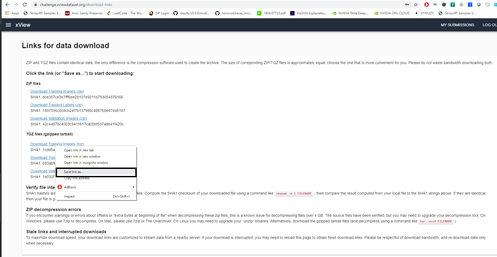

# Running Satellite Imagery Demo    

This documentation is a step by step guide to runninng the satellite imagery object detection demo from [Xview](https://github.com/DIUx-xView). 
We're not going to train the model here, this is just an off the shelf inference with their vanilla 
baseline model.


Credits : https://challenge.xviewdataset.org/data-download

### Step 1. Check Validation System Specifications

This demo is validated on a Dell PowerEdge C4130 system having the following specs:

##### H/W Specs:

* 2 X Intel(R) Xeon(R) CPU E5-2690 v4 @ 2.60GHz
* 256 GB DDR4 Ram Memory 
* 2TB disk space
* 4 X Nvidia Tesla P100 PCIe 16GB graphic cards.
* Logitech HD Pro Webcam C920

##### S/W Specs:
* CentOS Linux 7 (Core)
* Docker 1.13.1
* Git 1.8.3.1 

If you want a detailed spec about the system this demo is validated on, please check [here](hwinfo.html "Hardware Spec Info"). 


### Step 2. Ensure Prerequisites

Although you might not need an extensive system as the validation system, at the very least you need to have a base installation of Unix OS such as RHEL Centos or Ubuntu and a working docker already installed
to run this demo.  This also requires atleast 50GB (after uncompressing dataset & keeping the original tar as well) of disk space to run. 

If you don't have docker installed, the following links explains how to install docker.
 

For Centos 
```
https://docs.docker.com/install/linux/docker-ce/centos/
```

For Ubunutu 
```
https://docs.docker.com/install/linux/docker-ce/ubuntu/
```


### Step 3. Getting the dataset  

* Create an account at the Xview website to download the dataset. 
```
https://challenge.xviewdataset.org/signup
```


* Login with the credentials and once you're in, you'll be presented with a tab that allows you to download.


If for some reason if you can't find it, go to the following link below:

```
https://challenge.xviewdataset.org/data-download
```

* Check out all the tabs, they're titled "Explore", "Format", "Download". Read through the Agreement and click on 
"I AGREE, PROCEED TO DOWNLOAD"


* Create a new folder called ``dataset``. It is important for the folder to be called the same. 

* You'll be presented with a page that contains links to ``TAR Files``. You'll need to download ``Training Images`` and 
``Training Labels``. To Download, right click and choose ``save link as`` and download both files into the ``dataset`` folder.



* (optional step) If you're interested in how DUIx collected the dataset and their baseline model performance, you may read their paper here:

```
https://arxiv.org/abs/1802.07856
```

### Step 4. Organizing the dataset folder 
* The folder contents must be in a certain structure for the demo jupyter notebook to run.

* Once you have downloaded these two files, your ``dataset`` must have only 2 files:

```
dataset:
    * train_images.tgz
    * train_labels.tgz
```
 

* To organize the folder in the expected structure, you need to get the bash script that does it for you, type in your terminal :
```
wget 
```
